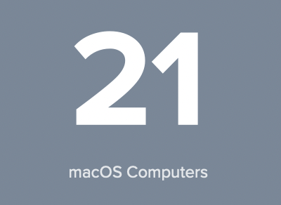
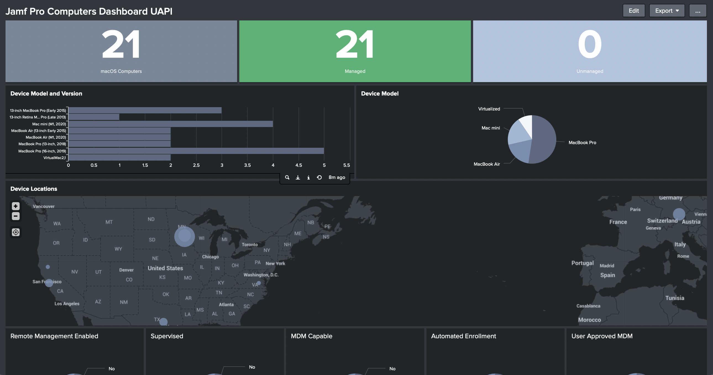
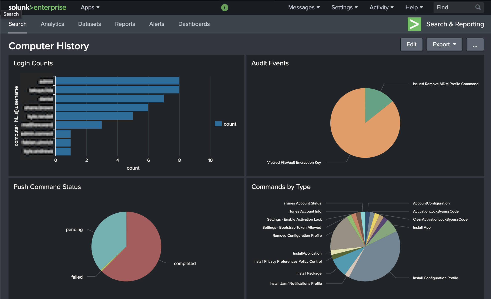

# Guide to Splunk Jamf Pro Dashboard Examples

### What's this? 

You can look at the example dashboards here to get a feel for how to query the data imported to Splunk by the Jamf Pro add-on for Jamf Pro. 


### Search Basics

I find the easiest way to get at the Jamf Pro data is to use sourcetype. Your milage may vary depending on how you partition your indexes. 

Here's a simple example... 

	sourcetype="jssUapiComputer:computerGeneral"
	| dedup computer_meta.id 
	``` The above lines select the most recent record from each computer obtained via the Jamf Pro Add-on for Splunk```
	``` Output a simple count of the computers``` 
	| stats count

That yields: 



These are the data segments you can use when builting your searches...

> Note: When you setup an input in the Jamf Pro add-in for Splunk, you specified a value for "Name of the Modular Input". In my setup, that is "jssUapiComputer", so any place you see that, you'll need to change it to  whatever you called it when you setup your inputs.  

	jssUapiComputer:computerGeneral
	jssUapiComputer:computerHardware
	jssUapiComputer:computerSecurity
	jssUapiComputer:app
	jssUapiComputer:certificate
	jssUapiComputer:configProfile
	jssUapiComputer:diskEncryption
	jssUapiComputer:diskPart
	jssUapiComputer:extensionAttribute
	jssUapiComputer:localAccount
	jssUapiComputer:operatingSystem
	jssUapiComputer:printer
	jssUapiComputer:purchasing
	jssUapiComputer:softwareUpdates
	jssUapiComputer:userAndLocation


## Example Dashboard Source Files

[jamfComputers](dashboards/computers/jamfComputers/computers_general.txt)



[computer_history](dashboards/computer_history/computer_history.txt)

(The data for this comes from a script I run outside of the official Jamf add-on. See the "jamf\_splunk\_api\_export_scripts" folder)

